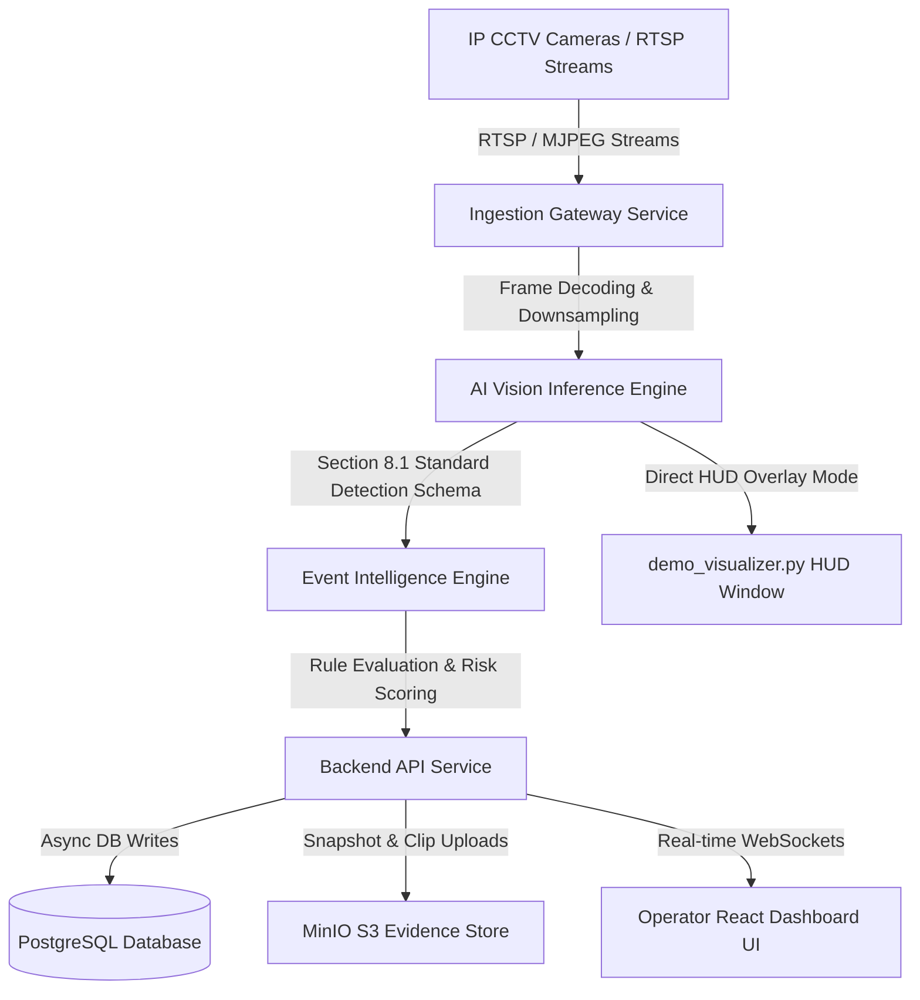

# BAVIS — System Technical Audit & Architecture Report

**Border AI Video Intelligence System (BAVIS)**  
*Smart India Hackathon 2026 · Problem Statement SIH26187*  
*Ministry of Home Affairs (MHA) · Sashastra Seema Bal (SSB), Police II Division*  
*Theme: Blockchain & Cybersecurity*

---

## Executive Summary

**BAVIS (Border AI Video Intelligence System)** is a software-defined, retrofit-first AI video analytics platform engineered to convert legacy and existing IP-based CCTV infrastructure at remote Border Out Posts (BOPs), check posts, and border roads into an intelligent, autonomous surveillance network.

### Key Mission
- **Retrofit-First Architecture**: Eliminates the cost of upgrading legacy IP cameras with expensive "smart camera" edge hardware by performing AI decoding, object detection, multi-object tracking, and event correlation on standard RTSP/MJPEG video streams.
- **Real-Time Border Surveillance**: Detects persons, vehicles, faces, and license plates while identifying suspicious behaviors (virtual fence breaches, nighttime intrusions, extended dwell times).
- **Security & Cybersecurity Constraints**: Adheres to strict privacy-preserving rules (bounding-box face detection without invasive biometric harvesting), strict data retention metadata, and audit logging.

---

## Architecture Overview & Workstreams

The repository is organized into five core functional workstreams and an infrastructure orchestration tier:



### Component Breakdown

| Workstream | Directory | Core Technology | Primary Responsibility |
| :--- | :--- | :--- | :--- |
| **Workstream A** | [`ai_engine`](file:///e:/BAVIS/ai_engine) / [`bavis-infra/ai-engine`](file:///e:/BAVIS/bavis-infra/ai-engine) | Python 3.11, PyTorch, Ultralytics YOLOv8/v11, OpenCV, ByteTrack, EasyOCR | Computer vision inference pipeline: Person/Vehicle detection, MOT tracking (`track_id`), CLAHE night vision enhancement, Face box detection, ANPR OCR. Serves REST API via FastAPI. |
| **Workstream B** | [`bavis-backend`](file:///e:/BAVIS/bavis-backend) / [`bavis-infra/backend-api`](file:///e:/BAVIS/bavis-infra/backend-api) | FastAPI, AsyncIO, SQLAlchemy 2.0 (Async), WebSockets, PyJWT, HTTPX | Stream ingestion manager, standard REST endpoints, authentication, real-time alert broadcasting over WebSockets, evidence indexing, C2 webhook dispatch. |
| **Workstream C** | [`bavis-frontend`](file:///e:/BAVIS/bavis-frontend) / [`bavis-infra/frontend`](file:///e:/BAVIS/bavis-frontend) | React 19, TypeScript, Vite, Tailwind CSS v4, Lucide Icons | Tactical operator dashboard with real-time video canvas bounding box rendering, live incident feed, zone/virtual fence editor, operational map, evidence viewer. |
| **Workstream D** | [`bavis-datastorage`](file:///e:/BAVIS/bavis-datastorage) | PostgreSQL 15/16, MinIO (S3 API), Alembic, SQLAlchemy ORM | Single source of truth database schema, Alembic migration scripts, MinIO object bucket setup script with 90-day retention policies, seed script. |
| **Workstream E** | [`bavis-infra/intelligence`](file:///e:/BAVIS/bavis-infra/intelligence) | Python, Rules Engine | Spatial-temporal rule processing (virtual fence breach, intrusion, dwell time, risk scoring). |
| **DevOps & Infra** | [`bavis-infra`](file:///e:/BAVIS/bavis-infra) | Docker, Docker Compose, Nginx, Redis | Container orchestration, Nginx reverse proxy configuration, Redis caching/messaging queue. |

---

## Detailed Technical Stack Audit

### 1. Workstream A — AI / CV Inference Engine
- **Frameworks**: Python 3.11+, PyTorch (CUDA / CPU auto-selection), Ultralytics (YOLO), OpenCV, Supervision (`supervision.ByteTrack`), EasyOCR.
- **Key Modules**:
  - `low_light.py`: CLAHE (Contrast Limited Adaptive Histogram Equalization) preprocessing triggered dynamically when average frame brightness falls below `35.0`.
  - `detector.py`: YOLOv8/v11 deep neural network object detector returning normalized bounding boxes (`[x1, y1, x2, y2]`) and class confidences for persons and vehicles.
  - `tracker.py`: Stateful `ByteTrack` multi-object tracker maintaining unique, persistent `track_id` strings across consecutive video frames per `camera_id`.
  - `face_detector.py`: Bounding-box-only face marker detection (Haar Cascade / Deep Face Detector) preserving operator situational awareness while maintaining privacy compliance.
  - `anpr.py`: Region of Interest (ROI) cropping on detected vehicles followed by bilateral filtering and OCR text extraction.
  - `pipeline.py`: Unified 5-stage inference coordinator (`VideoIntelligencePipeline`).
  - `server.py`: FastAPI application serving `/infer`, `/infer/upload`, `/infer/anpr`, `/health`, and `/metrics`.
- **Shared Detection Contract (Section 8.1)**:
  ```json
  {
    "camera_id": "cam_bop_north_01",
    "frame_ts": "2026-09-02T14:19:00.000Z",
    "object_type": "person",
    "confidence": 0.9412,
    "bbox": [450.0, 380.0, 510.0, 540.0],
    "track_id": "trk_cam_bop_north_01_1",
    "attributes": {
      "sub_class": "person",
      "low_light_enhanced": false
    }
  }
  ```

### 2. Workstream B — Ingestion & Backend Gateway
- **Frameworks**: FastAPI, AsyncIO, SQLAlchemy 2.0 (Async Engine), Alembic, Pydantic v2, PyJWT, HTTPX, WebSockets.
- **Key Modules**:
  - `ingestion.py`: `StreamIngestionManager` running concurrent background tasks per active camera, handling RTSP/MJPEG video decoding via OpenCV, downsampling, posting frames to the AI Engine, evaluating rule triggers, writing DB entities, and triggering WebSockets.
  - `ai_client.py`: Async HTTP client communicating with `ai_engine`. Includes automatic fallback to synthetic mock detections if the AI server is offline or set to `USE_MOCK_AI=True`.
  - `alert_service.py`: WebSocket broadcaster pushing JSON alert events directly to active frontend web clients.
  - `auth.py`: JWT-based role-based access control (RBAC) supporting `admin`, `supervisor`, and `operator` roles.

### 3. Workstream C — Frontend Operator UI/UX
- **Frameworks**: React 19, TypeScript, Vite, Tailwind CSS v4, Lucide Icons, Oxlint.
- **Key Components**:
  - `VideoCanvasRenderer.tsx`: Canvas-based real-time video player with dynamic overlay drawing of bounding boxes, track IDs, velocity vectors, and risk badges.
  - `RealtimeAlertPanel.tsx`: Live WebSocket event listener displaying incoming perimeter alerts with audio/visual warnings.
  - `ZoneEditor.tsx`: Interactive zone drawing utility allowing operators to define custom virtual fences and restricted polygonal areas.
  - `IncidentTimeline.tsx` & `EventSearch.tsx`: Filtering and playback of past incident logs and evidence snapshots.
  - `OperationalMap.tsx`: Geospatial overview of camera deployments across border posts.

### 4. Workstream D — Data & Storage Tier
- **Relational Storage**: PostgreSQL 15/16 (or SQLite for lightweight local dev).
- **Object Storage**: MinIO S3 API storing full-resolution frame snapshots (`.jpg`) and clip evidence (`.mp4`) under `bavis-evidence/cameras/<camera_id>/`.
- **Database Schema**:
  - `cameras`: Metadata, stream URLs, location codes, online/offline status.
  - `detections`: Raw frame detection records (timestamp, bbox coordinates, track ID, object type, confidence).
  - `tracks`: Aggregated target tracks (start time, end time, trajectory summaries).
  - `alerts`: Security events generated by rule breaches (severity, status, acknowledged by, evidence reference).
  - `evidence`: S3 snapshot/clip path references and retention metadata.
  - `zones`: Virtual fence and spatial boundaries linked to cameras.
  - `audit_logs`: Immutable security log tracking operator logins, alert acknowledgments, and configuration changes.

---

## Hardware & System Requirements

### Hardware Requirements for Single Laptop Setup

| Component | Minimum Specs | Recommended Specs |
| :--- | :--- | :--- |
| **CPU** | Intel Core i5 / AMD Ryzen 5 (4+ Cores) | Intel Core i7 / i9 or AMD Ryzen 7 / 9 (8+ Cores) |
| **RAM** | 8 GB RAM | 16 GB or 32 GB RAM |
| **GPU** | CPU-only (OpenVINO / PyTorch CPU) | NVIDIA GeForce RTX 3060 / 4060 or higher (CUDA 11.8 / 12.x) |
| **Storage** | 10 GB free SSD space | 25 GB free NVMe SSD space |
| **Webcam / Stream** | Built-in Laptop Webcam / Local `.mp4` file | Built-in Webcam + RTSP Stream |

### Software Requirements
- **Operating System**: Windows 10/11, macOS, or Ubuntu 20.04/22.04 LTS.
- **Python**: Version `3.11.x` (recommended) or `3.10.x`.
- **Node.js**: Version `18.x` or `20.x` LTS.
- **Docker**: Docker Desktop (required for option 2 full containerized stack; optional for native option 1).
- **Git**: Latest version.

---

## Step-by-Step Guide: Running the Whole Setup on a Single Laptop

You can run BAVIS using either **Method 1 (Native Local Developer Setup - Recommended for quick testing)** or **Method 2 (Full Containerized Docker Stack)**.

---

### Method 1: Lightweight Native Setup (Fastest & Recommended)

This mode runs all services directly on your laptop without requiring complex Docker setup.

#### Step 1: Clone & Open Terminal
Open PowerShell or Command Prompt in the project folder (`e:\BAVIS`):
```powershell
cd e:\BAVIS
```

#### Step 2: Set Up Python Virtual Environment & Install Dependencies
```powershell
# Create virtual environment
python -m venv venv

# Activate virtual environment (Windows PowerShell)
.\venv\Scripts\Activate.ps1

# Upgrade pip and install all Python dependencies
python -m pip install --upgrade pip
pip install -r requirements.txt
```

#### Step 3: Initialize Database & Seed Data
By default, the backend uses a local SQLite database (`bavis.db`) or PostgreSQL if Docker is running.
```powershell
# Run the database seeder script to populate sample cameras, alerts, and zones
python bavis-backend/scripts/seed_data.py
```

#### Step 4: Launch the AI Inference Service (Terminal 1)
Open **Terminal 1** (with `venv` activated):
```powershell
python -m uvicorn ai_engine.server:app --host 0.0.0.0 --port 8000 --reload
```
*Verification*: Open your browser to [http://localhost:8000/docs](http://localhost:8000/docs) to view the interactive FastAPI Swagger UI.

#### Step 5: Launch the Backend API Service (Terminal 2)
Open **Terminal 2** (with `venv` activated):
```powershell
$env:PYTHONPATH="e:\BAVIS\bavis-backend"
python -m uvicorn app.main:app --host 0.0.0.0 --port 8001 --reload
```
*Verification*: Open your browser to [http://localhost:8001/docs](http://localhost:8001/docs) to verify backend routes.

#### Step 6: Launch the Frontend Operator Dashboard (Terminal 3)
Open **Terminal 3**:
```powershell
cd e:\BAVIS\bavis-frontend

# Install Node modules (if not already installed)
npm install

# Start Vite development server
npm run dev
```
*Verification*: Open [http://localhost:5173](http://localhost:5173) in Chrome or Edge to access the BAVIS Operator Dashboard.

---

### Method 2: Complete Containerized Stack (Docker Compose)

If you have **Docker Desktop** installed and running on your laptop, you can bring up the entire multi-service stack with a single command.

#### Step 1: Navigate to Infrastructure Directory
```powershell
cd e:\BAVIS\bavis-infra
```

#### Step 2: Copy Environment File
```powershell
copy .env.example .env
```

#### Step 3: Build & Start All Containers
```powershell
docker-compose up --build -d
```

#### Step 4: Verify Running Containers
```powershell
docker-compose ps
```

#### Service Endpoint Summary (Docker Mode):
- **Frontend Dashboard**: [http://localhost:3000](http://localhost:3000) or [http://localhost:8080](http://localhost:8080) (Nginx)
- **Backend Gateway API**: [http://localhost:8000](http://localhost:8000)
- **AI Vision Engine**: [http://localhost:8002](http://localhost:8002)
- **Ingestion Gateway**: [http://localhost:8001](http://localhost:8001)
- **Intelligence Engine**: [http://localhost:8003](http://localhost:8003)
- **MinIO Console (Storage UI)**: [http://localhost:9001](http://localhost:9001) *(User: `minioadmin` / Pass: `minioadmin`)*
- **PostgreSQL**: `localhost:5432`

#### To Stop Docker Stack:
```powershell
docker-compose down
```

---

### Bonus Method 3: Instant Live Webcam HUD Demonstration

If you want to immediately test the AI Computer Vision pipeline using your laptop's built-in webcam or a video file with a visual OpenCV overlay window:

```powershell
# Run on built-in laptop webcam (Camera Index 0):
python demo_visualizer.py --source 0

# Or run on a sample video file:
python demo_visualizer.py --source "path/to/video.mp4"
```
*(Press **'q'** inside the OpenCV monitor window to exit).*

---

## Verification & Testing Matrix

To confirm that all components are functioning correctly:

1. **Automated Unit & Pipeline Tests**:
   ```powershell
   pytest tests/test_pipeline.py -v
   ```
2. **AI Inference Load Testing**:
   ```powershell
   python tests/load_test.py
   ```
3. **API Diagnostics Health Endpoint**:
   ```powershell
   curl http://localhost:8000/health
   ```
   *Expected Output*:
   ```json
   {
     "status": "healthy",
     "device": "cpu",
     "gpu_available": false,
     "loaded_models": {
       "yolo_detector": true,
       "tracker": true,
       "face_detector": true,
       "anpr_ocr": true,
       "low_light_enhancer": true
     }
   }
   ```

---

## Technical Audit Summary & Strategic Recommendations

### Strengths
- **Modular & Clean Decoupling**: AI Engine, Ingestion, Backend, Frontend, and Data tiers communicate via well-defined Pydantic contract schemas.
- **Fail-Safe Robustness**: `ai_client.py` gracefully degrades to simulated detections if the AI server experiences downtime, preventing UI lockup during live demos.
- **Low-Light Resilience**: CLAHE preprocessing enables reliable night vision analytics without custom thermal cameras.
- **Complete Test Coverage**: Includes synthetic stream generators, load tests, and visual HUD debugging tools out of the box.

### Recommended Production Enhancements
1. **Model Acceleration**: Convert PyTorch YOLO weights (`.pt`) to ONNX Runtime (`.onnx`) or NVIDIA TensorRT (`.engine`) for 3x-5x higher FPS on laptop GPUs.
2. **Media Streaming Protocol**: Replace base64 frame HTTP polling with WebRTC or HLS (HTTP Live Streaming) / RTSP-to-WebSockets (go2rtc or MediaMTX) for sub-100ms ultra-low latency live video feeds.
3. **Database Migration**: Ensure Alembic migrations are executed against PostgreSQL in production deployments for high concurrent write performance during multi-camera ingestion.

---
*Report Generated: September 2026 · BAVIS System Audit Document*
